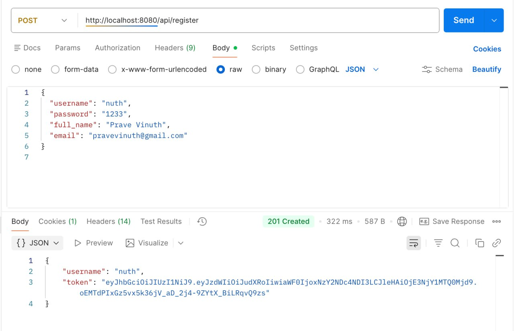

# Group Member:
1. Prave Vinuth
2. Rom Tola
3. Sokhom Panha
4. Sreng Panha
<h3 style="text-align: center;">Project Progression</h3>

## Project Name: Library tracking system

#### In the second week we have done some part such as:
* **update table schema** 
  * change Id datatype from varchar to bigint

* **AuthController**

  * Created REST controller for authentication.
  * Exposed endpoints for **login** and **register**.
  * Integrated with `UserService`.

* **Login**

  * **LoginRequest**: username/email & password DTO implemented.
  * **LoginResponse**: returns auth result (message / token / user info).
  * Validation and error handling added.

* **Register**

  * **RegisterRequest**: user input DTO (username, password, email, etc.).
  * **RegisterResponse**: registration status and user data.
  * Password encoding applied before saving.

* **UserService**

  * Business logic for login and registration.
  * User lookup and creation implemented.
  * Connected to repository and security components.

* **JwtFilter**

    * Implemented JWT authentication filter.

    * Extracts token from request header.
 
    * Validates JWT and sets authentication in SecurityContext.
 
    * JwtProperties
 
    * Configured JWT settings (secret key, expiration time).
 
    * Loaded values from application.yml / properties.

* **JwtUtil**

    * Implemented JWT generation and validation logic.

    * Extracts username and checks token expiration.
    
    * Used by AuthController and JwtFilter.
    
    * SecurityConfig
    
    * Configured Spring Security with JWT.
    
    * Disabled CSRF for REST API.
    
    * Defined public and protected endpoints.
    
    * Registered JwtFilter in security filter chain.

