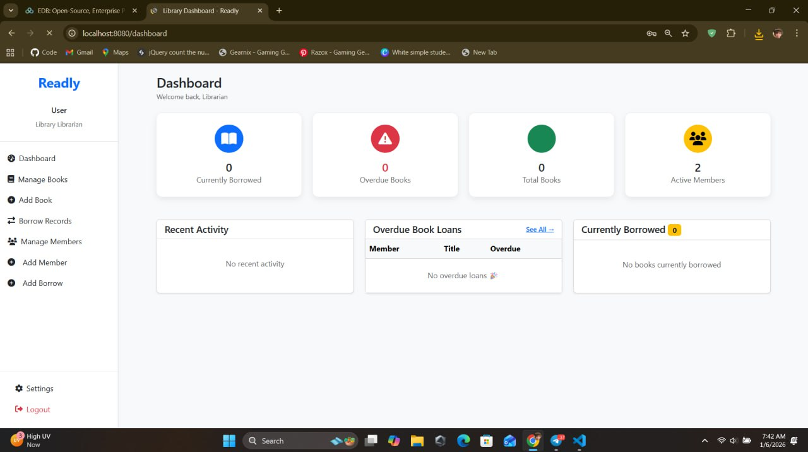
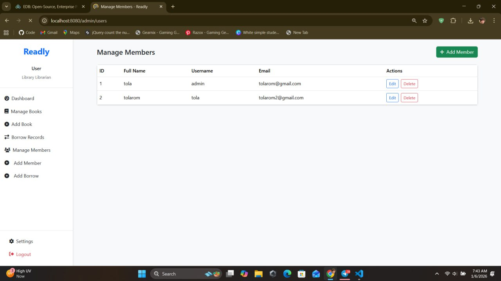
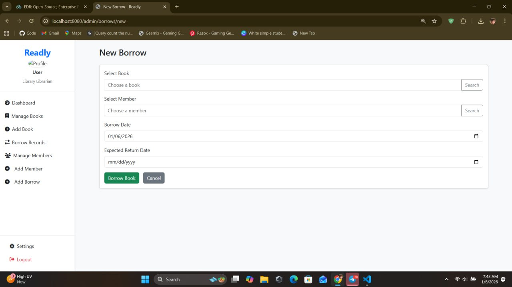
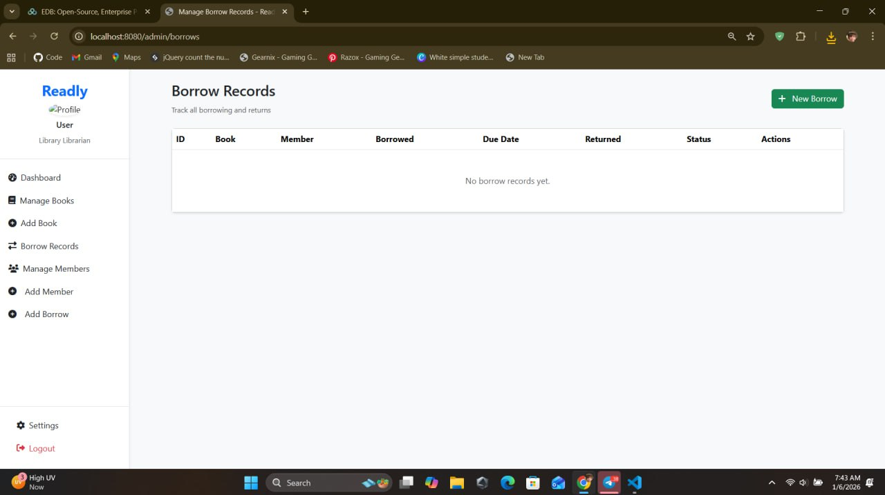

# Task 1: Create Login / Logout

## Module: Security & Login  
**Status:** ⏳ In Progress (backend mostly completed, frontend not connected)

---

## 1. Folder: `authorize`

### AuthResponse
**Purpose:**  
- Represents the response sent to the client after a successful login use test on postman.  
- Contains user information and authentication token.

**Function:**  
- Sends authentication results and user role data back to the frontend.

---

### LoginRequest
**Purpose:**  
- Captures user input for login from the frontend.  

**Function:**  
- Used by the backend to verify credentials during login.

---

### LoginResponse
**Purpose:**  
- Encapsulates the result of a login attempt.  

**Function:**  
- Contains login status, token, and user info or error messages.

---

### RegisterRequest
**Purpose:**  
- Captures user input during registration.  

**Function:**  
- Used to create a new user in the system.

---

## 2. Task Updates

### RoleEntity
**Purpose:**  
- Represents user roles in the system (e.g., MEMBER, ADMIN).  

**Function:**  
- Defines roles and permissions for access control.

---

### UserEntity
**Purpose:**  
- Represents a user in the system.  

**Function:**  
- Maps user data to the database.  
- Supports role-based authentication.

---

### UserRepository
 
- Queries users by username for login .

---

## 3. Frontend Integration

### Login
**Status:**  
- Added but not yet connected to backend.

**Function:**  
- Provides the user interface for login.  
- Sends login data to the backend and receives authentication results.  
- Stores authentication token for session management.  
- Handles login errors and redirects users based on roles.

 

---

## 3. Frontend Implementation (HTML + Thymeleaf)

### Login Page

**Technology Used:**

* HTML
* Thymeleaf Template Engine

## LIBRARIAN
### Dashbord

### Manage book 

### Add Book

### Manage Member

### Add Borrow

### Manage Borrow

---

## 4. Role-Based Access Control (RBAC)

### MEMBER Role

**Access Permissions:**

* View available books.
* Borrow and return books.
* View personal borrowing history.

**Frontend Behavior:**

* Thymeleaf conditionally displays MEMBER-only menus.
* Restricted from accessing librarian management pages.

---

### LIBRARIAN Role

**Access Permissions:**

* Manage books (add, update, delete).
* View all borrow records.
* Manage members and borrowing status.

**Frontend Behavior:**

* Thymeleaf displays librarian dashboard and management features.
* Protected routes accessible only to librarians.

---

## 5. Security Flow Summary

1. User submits login form (HTML + Thymeleaf).
2. Backend authenticates credentials.
3. JWT token and role are returned.
4. Frontend stores token for session usage.
5. Thymeleaf templates render UI based on user role.

---

## 6. Task Completion Summary

| Component             | Status                      |
| --------------------- | --------------------------- |
| AuthResponse          | Completed                   |
| LoginRequest          | Completed                   |
| LoginResponse         | Completed                   |
| RegisterRequest       | Completed                   |
| RoleEntity            | Updated (MEMBER, LIBRARIAN) |
| UserEntity            | Updated                     |
| UserRepository        | Updated                     |
| Login Page (HTML)     | Completed                   |
| Thymeleaf Integration | Completed                   |
| Role-Based UI         | Implemented                 |

---

